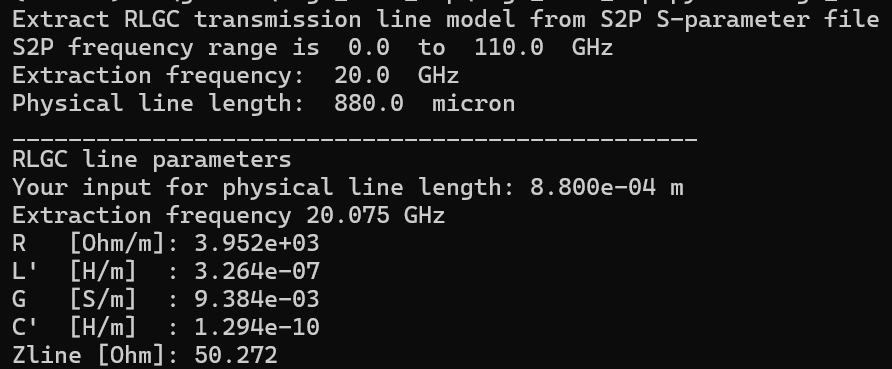

# rlgc_from_s2p

This tool reads S-parameter data (*.s2p) for a single ended 
transmission line with 2 ports, and calculates component values 
for a RLGC line model



# Theory of operation:
The S-parameters at one user defined frequency are extracted 
and the corresponding series and shunt path elements are calculated.
Line impedance is calculated from Y11 and Z11.
RLGC values per meter physical length are calculated.

IMPORTANT: you need to specify the correct physical length as 
a command line parameter, this is required for calculation!

# Prerequisites
The code requires Python3 with the skitkit-rf library.
https://scikit-rf.readthedocs.io/en/latest/tutorials/index.html

# Usage
Ro run the RLGC model extraction, specify the *.s2p file as the first parameter, 
followed by the extraction frequency in GHz, followed by physical length of the line
in microns.

example:
```
python rlgc_from_s2p.py line880um.s2p 20 880
```
output: 
```
Extract RLGC transmission line model from S2P S-parameter file
S2P frequency range is  0.0  to  110.0  GHz
Extraction frequency:  20.0  GHz
Physical line length:  880.0  micron
_________________________________________________
RLGC line parameters
Your input for physical line length: 8.800e-04 m
Extraction frequency 20.075 GHz
R   [Ohm/m]: 3.952e+03
L'  [H/m]  : 3.264e-07
G   [S/m]  : 9.384e-03
C'  [H/m]  : 1.294e-10
Zline [Ohm]: 50.272
```


# Accuracy
Note that the extracted fixed values do not provide an  accurate wide band 
fit of the S2P data, they are exact only at the extraction frequency.
Most often, L' and C' don't vary much, but the losses from skin effect 
might result in frequency dependent R' values. 
It is recommended to extract at the most relevant frequency.

